# 🐾 Compatibillabuddy

**An autonomous AI agent that diagnoses AND repairs broken Python ML environments — with self-correction.**

[](https://pypi.org/project/compatibillabuddy/)
[](https://pypi.org/project/compatibillabuddy/)
[](https://github.com/jemsbhai/compatibillabuddy/actions/workflows/ci.yml)
[](https://opensource.org/licenses/MIT)
[]()

---

> **Built for the Google DeepMind × Devpost Gemini API Hackathon — Marathon Agent Track**
>
> 🧠 An autonomous system that plans, executes, verifies, and self-corrects — not a chatbot, not a prompt wrapper.

## The Problem

```
$ pip install torch numpy pandas scikit-learn
# ✅ Successfully installed ...

$ python -c "import torch; print(torch.cuda.is_available())"
# ❌ False — wrong CUDA version for your GPU driver

$ python -c "import sklearn"
# ❌ ImportError: numpy ABI incompatibility
```

ML environments don't just have version conflicts — they have **hardware mismatches**, **ABI breaks**, and **runtime incompatibilities** that `pip`, `uv`, and `poetry` can't catch. These failures waste hours of developer time across the ML ecosystem.

**Compatibillabuddy treats hardware as a first-class dependency** and ships an autonomous Gemini-powered agent that can diagnose AND repair these issues without human intervention.

## How It Works

```mermaid
flowchart TD
    A["🧑 User: 'Fix my environment'"] --> B["📸 Snapshot Environment"]
    B --> C["🩺 Run Doctor (diagnose)"]
    C --> D{Issues Found?}
    D -- No --> E["✅ Report: Environment Healthy"]
    D -- Yes --> F["🧠 Gemini Plans Fix Order"]
    F --> G["🔧 Execute Fix (pip install/uninstall)"]
    G --> H["🔍 Verify Fix (re-diagnose)"]
    H --> I{Improved?}
    I -- Yes --> J{More Issues?}
    J -- Yes --> G
    J -- No --> K["✅ Report: All Fixed + Changelog"]
    I -- No --> L["⏪ Rollback to Snapshot"]
    L --> M["🔄 Try Alternative Fix"]
    M --> H
```



The agent doesn't guess — it runs **real diagnostics** via structured tools, executes **real pip commands** with safety guardrails, and **verifies every fix** before moving on. If a fix makes things worse, it **rolls back automatically** and tries an alternative.

## Installation

```bash
# Core framework (no AI, works offline)
pip install compatibillabuddy

# With Gemini-powered AI agent
pip install "compatibillabuddy[agent]"
```

## Quick Start

### 1. Diagnose Your Environment (No AI Required)

```bash
# Human-readable console report
compatibuddy doctor

# Machine-readable JSON
compatibuddy doctor --format json

# Save to file
compatibuddy doctor --output report.json --format json
```

### 2. Autonomous Repair (Gemini Agent)

```bash
# Set your API key
export GEMINI_API_KEY="your-key-here"  # Linux/Mac
$env:GEMINI_API_KEY = "your-key-here"  # PowerShell

# Dry run — see what the agent WOULD do (safe, default)
compatibuddy repair

# Live mode — actually execute fixes
compatibuddy repair --live

# JSON output for programmatic use
compatibuddy repair --format json

# Choose model and retry limits
compatibuddy repair --model gemini-2.5-pro --max-retries 5
```

### 3. Interactive Chat

```bash
# Start an interactive session with the agent
compatibuddy agent

# You: What GPU do I have?
# Agent: [calls tool_probe_hardware] You have an NVIDIA RTX 4090 with CUDA 12.3...
# You: Run a diagnosis
# Agent: [calls tool_run_doctor] Found 2 issues...
# You: Fix the CUDA mismatch
# Agent: [calls tool_snapshot_environment, tool_run_pip, tool_verify_fix] ...
```

## Architecture

```
compatibillabuddy/
├── hardware/          # GPU detection, nvidia-smi parsing, platform info
│   ├── probe.py       # probe_hardware() → HardwareProfile
│   └── inspector.py   # inspect_environment() → EnvironmentInventory
├── kb/                # Knowledge base of known-bad combinations
│   ├── engine.py      # TOML rulepack loader + evaluator
│   └── rulepacks/     # Community-extensible rule definitions
│       └── ml_core.toml
├── engine/            # Core diagnosis orchestrator
│   ├── models.py      # Pydantic v2 models (GPU, packages, issues)
│   ├── doctor.py      # diagnose() → DiagnosisResult
│   └── report.py      # Rich console + JSON report formatters
├── agent/             # Gemini-powered autonomous agent
│   ├── config.py      # API key resolution, model selection
│   ├── tools.py       # 9 tools: diagnose, repair, snapshot, rollback
│   └── core.py        # AgentSession: chat loop + auto_repair()
└── cli/               # Typer CLI
    ├── doctor.py      # compatibuddy doctor
    ├── agent.py       # compatibuddy agent (interactive)
    └── repair.py      # compatibuddy repair (autonomous)
```

## Agent Tools

The Gemini agent has access to **9 structured tools** — not arbitrary shell access:

| Tool | Purpose |
|------|---------|
| `tool_probe_hardware` | Detect OS, CPU, GPU, CUDA version |
| `tool_inspect_environment` | List all installed Python packages |
| `tool_run_doctor` | Full compatibility diagnosis |
| `tool_explain_issue` | Detailed explanation of a specific issue |
| `tool_search_rules` | Search knowledge base for rules about a package |
| `tool_snapshot_environment` | Capture pip freeze as rollback point |
| `tool_run_pip` | Execute pip install/uninstall with safety guardrails |
| `tool_verify_fix` | Re-diagnose and compare before/after |
| `tool_rollback` | Restore packages to a previous snapshot |

## Safety Guardrails

The repair agent operates under strict safety constraints:

- **Virtual environment isolation** — refuses to modify system Python
- **Snapshot before every change** — full rollback capability
- **Dry-run by default** — shows what it would do without executing
- **Protected package blocklist** — never uninstalls pip, setuptools, wheel, or itself
- **Operation limit** — stops after 10 pip commands per session
- **Only pip install/uninstall** — no arbitrary shell commands
- **Automatic rollback** — if a fix introduces new problems, reverts immediately

## What Makes This Different

| Feature | Compatibillabuddy | Generic AI Chatbot |
|---------|-------------------|-------------------|
| Runs real diagnostics | ✅ Structured tool calls | ❌ Guesses from description |
| Executes real fixes | ✅ pip commands with guardrails | ❌ "Try running this command..." |
| Verifies every fix | ✅ Re-diagnoses after each change | ❌ No verification |
| Self-corrects | ✅ Rollback + alternative on failure | ❌ No error recovery |
| Works offline | ✅ `compatibuddy doctor` (no AI) | ❌ Requires API |
| Hardware-aware | ✅ GPU/CUDA as first-class dependency | ❌ Ignores hardware |
| Extensible rules | ✅ TOML rulepacks, community-driven | ❌ Hardcoded knowledge |
| Production quality | ✅ PyPI, 280+ tests, CI/CD | ❌ Demo/prototype |

## Known Compatibility Rules

The bundled `ml_core.toml` rulepack covers:

- **CUDA mismatches** — PyTorch, TensorFlow, JAX vs. detected CUDA version
- **NumPy ABI breaks** — pandas, scikit-learn, scipy built against incompatible NumPy
- **Driver conflicts** — GPU driver version vs. framework requirements

Rules are written in TOML and can be extended by the community:

```toml
[[rule]]
id = "cuda-torch-mismatch"
description = "PyTorch installed without CUDA support on a CUDA-capable system"
severity = "error"
category = "cuda-mismatch"
fix_suggestion = "pip install torch --index-url https://download.pytorch.org/whl/cu121"

[rule.when]
package_installed = "torch"
gpu_vendor = "nvidia"
```

## Development

```bash
git clone https://github.com/jemsbhai/compatibillabuddy.git
cd compatibillabuddy
pip install -e ".[all]"

# Run tests
pytest

# Lint
ruff check src/ tests/
ruff format --check src/ tests/

# Integration tests (requires GEMINI_API_KEY)
pytest tests/integration/ -m integration -v
```

## Tech Stack

- **Python 3.10+** (tested on 3.10–3.13)
- **Pydantic v2** — structured data models with JSON schema export
- **Typer + Rich** — CLI with beautiful terminal output
- **google-genai SDK** — Gemini function calling for the agent
- **packaging** — PEP 440 version matching
- **pytest** — 280+ tests with CI on 3 OS × 4 Python versions
- **Hatchling** — modern Python build backend

## License

MIT — see [LICENSE](LICENSE).

## Author

**Muntaser Syed** — [muntaser@ieee.org](mailto:muntaser@ieee.org)
